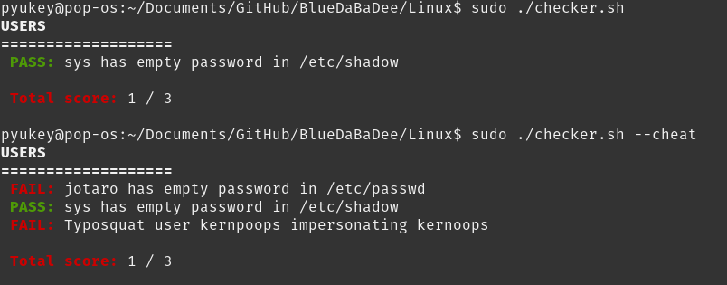

# Getting Started

The purpose of this repo is for you to be able to automate installing vulnerabilities on your machine so you can practice whenever you want, wherever your want.

To begin, run the following commands in a **Linux-based VM** (we support a large variety, even Reptilian OS!)

1. `git clone https://github.com/pyukey/BlueDaBaDee.git`
2. `cd BlueDaBaDee/Linux`
3. `sudo ./setup.sh`

Your machine is now vulnerable! Have fun patching it >:)

If you ever want to check your progress, you can run `sudo ./checker.sh` and it will list all the vulnerabilities you've successfully patched, as well as your total score. If you give up and don't know what the remaining vulnerabilities are, you can *cheat* by running `sudo ./checker.sh -c` or `sudo ./checker.sh --cheat`. 

